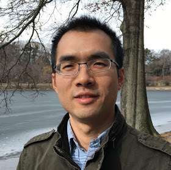

Research Fellow in [rafalab](http://rafalab.github.io)
  
[Department of Biostatistics & Computational Biology](http://bcb.dfci.harvard.edu)
at Dana-Farber Cancer Institute  
[Department of Biostatistics](https://www.hsph.harvard.edu/biostatistics)
at Harvard T.H. Chan School of Public Health

[Google Scholar](https://scholar.google.com/citations?user=T7QIObwAAAAJ) |
[GitHub](https://github.com/tengmx) |
[Twitter](https://twitter.com/mingxiangteng) |
[Email](mailto:mxteng@jimmy.harvard.edu) 

---

### Research

I develop computational and statistical methods for genomics analysis.
Particularly, I focus on inferring genomics findings by pre-processing 
and analyzing of high-throughput sequencing data and by integrating and 
visualizing with public data resources. My latest researches include 
[GC bias correction](http://genome.cshlp.org/content/early/2017/10/12/gr.220673.117.abstract) for ChIP-seq data,
[statistical benchmarks](https://doi.org/10.1186/s13059-016-0940-1)
of quantification pipelines for RNA-seq data, and other collaborative works.

### Education

I received my BEng, MEng and PhD from 
[School of Computer Science and Technology](http://encs.hit.edu.cn/)
at Harbin Institute of Technology
under the direction of Prof. Yadong Wang. My PhD works focused on
computational analysis methods for 
[regulatory single nucleotide variants](https://doi.org/10.1093/bioinformatics/bts275) and 
[DNA methylation fidelity](https://doi.org/10.1371/journal.pone.0032928).
I was also a visiting graduate student in the
[Center for Computational Biology and Bioinformatics](http://www.compbio.iupui.edu)
at Indiana University School of Medicine under the direction of
Profs. Yunlong Liu and Lang Li.
